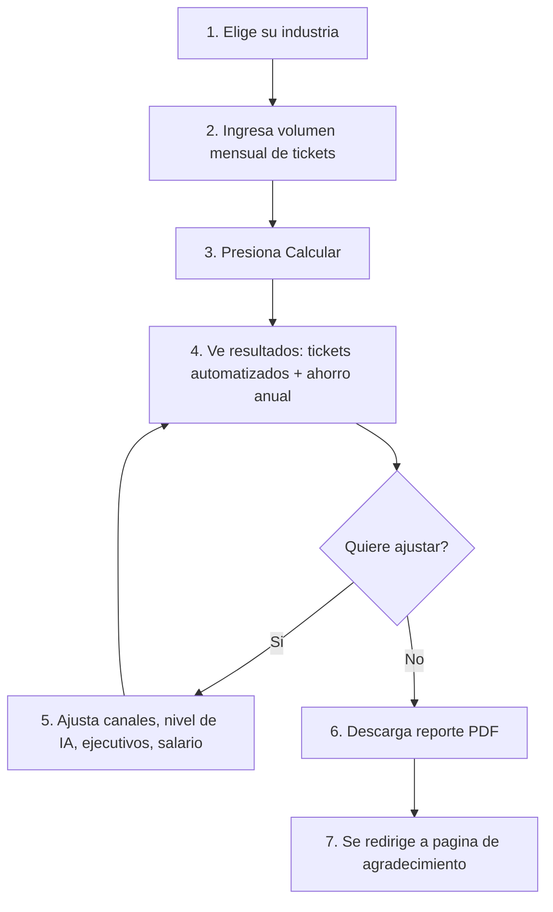
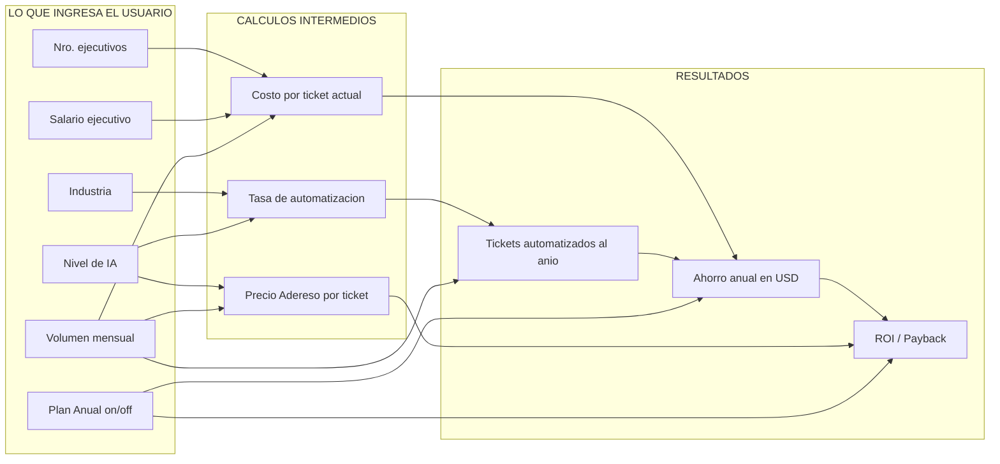
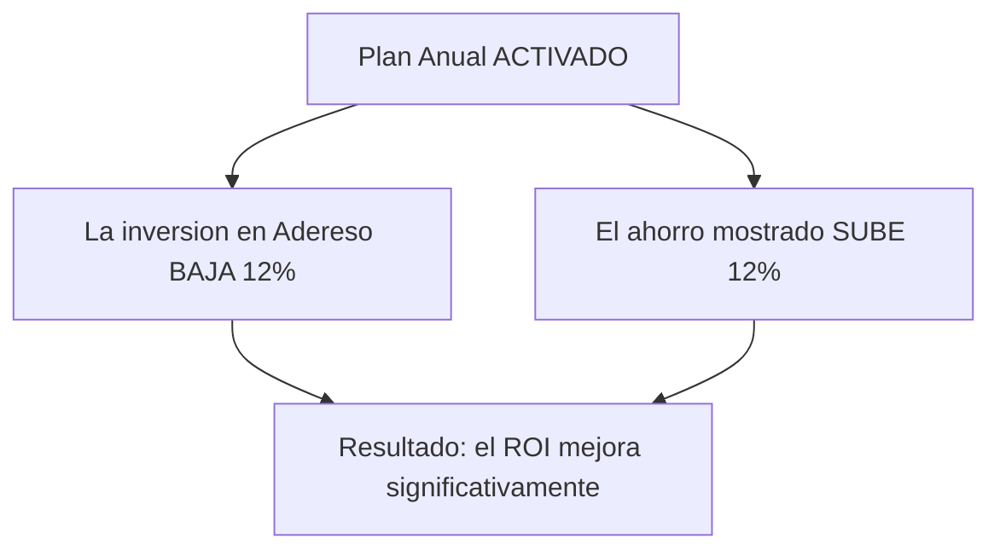
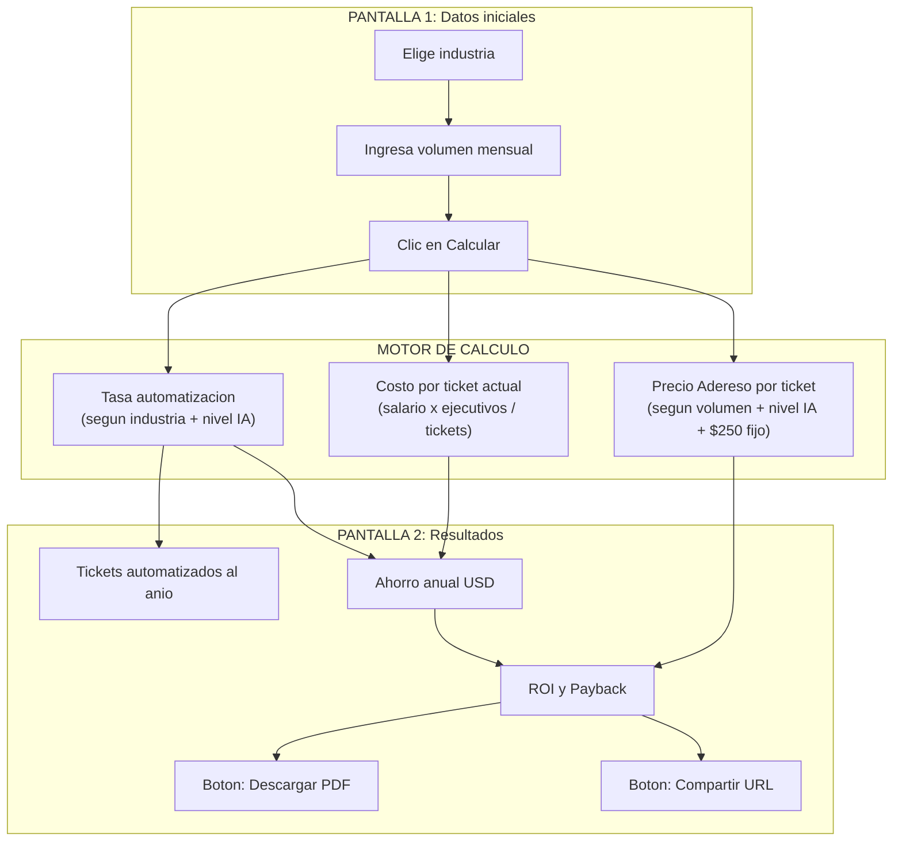

# Guia CRO - Calculadora ROI Adereso AI

## Que es y para que sirve

La calculadora ROI es una herramienta en nuestro sitio web que le muestra a un potencial cliente **cuanto dinero ahorraria al año** si automatiza su atencion al cliente con Adereso AI. El visitante ingresa sus datos, y la calculadora le devuelve dos numeros clave: cuantas conversaciones se automatizarian y cuanta plata se ahorra.

---

## Recorrido del usuario

Este es el camino que sigue el visitante desde que llega a la calculadora hasta que descarga su reporte:



**Resumen:** El visitante solo necesita 2 datos obligatorios para ver resultados (industria + volumen). Todo lo demas es opcional y viene con valores por defecto.

---

## Que le pedimos al usuario

### Datos obligatorios (Pantalla 1)

- **Industria** -- Elige entre: Retail, Servicios Financieros, Servicios Basicos u Otros. Esto define que tan bien funciona la IA para su tipo de negocio.
- **Volumen mensual de conversaciones** -- Cuantos tickets/conversaciones recibe su contact center al mes.

### Datos opcionales (Pantalla 2, ya vienen pre-llenados)

- **Distribucion por canal** -- Cuantos tickets son por chat, correo o redes sociales. Por defecto: 30% chats, 60% correos, 10% redes sociales.
- **Nivel de IA** -- Que tan sofisticada es la automatizacion. Opciones: Flujo (basica), GenAI Basica (intermedia), GenAI Plus (avanzada). Por defecto: Flujo.
- **Numero de ejecutivos** -- Se calcula solo (1 ejecutivo cada 600 tickets), pero el usuario puede cambiarlo.
- **Salario mensual por ejecutivo** -- Por defecto $1,000 USD.
- **Plan Anual** -- Un switch que viene activado por defecto. Aplica descuento del 12%.

---

## Como se calcula el resultado

Este diagrama muestra de donde sale cada numero. Las cajas de la izquierda son lo que ingresa el usuario, las del centro son calculos intermedios, y las de la derecha son los resultados finales:



**En simple:** la industria y el nivel de IA determinan que porcentaje se automatiza. El salario y los ejecutivos determinan cuanto cuesta cada ticket hoy. Multiplicando ambas cosas sale el ahorro.

---

## Tasas de automatizacion por industria

Esta es la tabla mas importante de la calculadora. Define **que porcentaje de los tickets la IA puede resolver sola**, segun la industria y el nivel de IA elegido:

| Industria | Flujo | GenAI Basica | GenAI Plus |
|---|---|---|---|
| **Retail** | 40% | 50% | 60% |
| **Servicios Financieros** | 60% | 70% | 75% |
| **Servicios Basicos** | 70% | 80% | 90% |
| **Otros** | 60% | 70% | 75% |

**Por que varia?**
- **Servicios Basicos** (luz, agua, gas) tiene las tasas mas altas porque sus consultas son muy repetitivas: "cual es mi saldo", "cuando vence mi boleta", etc.
- **Retail** tiene las mas bajas porque las consultas de compra son mas variadas y complejas.
- **Servicios Financieros y Otros** estan en un punto medio.

> Si quieres cambiar estas tasas, este es uno de los parametros ajustables. Ver seccion "Donde buscar si quieres cambiar algo" al final.

---

## Precios de Adereso segun volumen

Adereso cobra **por ticket**. Mientras mas tickets procesa el cliente, mas barato sale cada uno. Estos son los precios totales por ticket segun volumen y nivel de IA:

| Volumen mensual | Flujo | GenAI Basica | GenAI Plus |
|---|---|---|---|
| Hasta 4,500 | **$0.173** | **$0.222** | **$0.369** |
| Hasta 13,500 | **$0.158** | **$0.203** | **$0.336** |
| Hasta 40,500 | **$0.148** | **$0.190** | **$0.315** |
| Hasta 121,500 | **$0.136** | **$0.175** | **$0.291** |
| Hasta 364,500 | **$0.130** | **$0.168** | **$0.278** |
| Hasta 1,093,500 | **$0.123** | **$0.158** | **$0.262** |
| Hasta 3,280,500 | **$0.119** | **$0.153** | **$0.253** |

Ademas de este costo por ticket, siempre se suma un **cargo fijo de $250 USD al mes**.

> Los rangos escalan x3 (4,500 -> 13,500 -> 40,500 -> etc.). Si un cliente tiene 5,000 tickets, cae en el rango de "hasta 13,500".

---

## Las 3 formulas clave

Toda la calculadora se resume en 3 preguntas:

### 1. Cuanto le cuesta al cliente cada ticket HOY?

```
Costo por ticket = (Salario mensual x Ejecutivos x 12 meses) / (Tickets mensuales x 12 meses)
```

Es el costo total anual del contact center dividido por el total de tickets al anio. Si paga $1,000/mes a 5 ejecutivos y tiene 3,000 tickets/mes:

> ($1,000 x 5 x 12) / (3,000 x 12) = $60,000 / 36,000 = **$1.67 por ticket**

---

### 2. Cuanto se ahorra con Adereso?

```
Ahorro anual = Tickets automatizados al anio x Costo por ticket actual
```

Los tickets automatizados salen de multiplicar el volumen anual por la tasa de automatizacion. Si tiene 36,000 tickets/anio y la tasa es 70%:

> 36,000 x 70% = 25,200 tickets automatizados
> 25,200 x $1.67 = **$42,084 de ahorro anual**

---

### 3. Cuanto cuesta Adereso?

```
Inversion anual = ((Precio por ticket Adereso x Tickets mensuales) + $250 cargo fijo) x 12 meses
```

Si el precio por ticket es $0.222 y tiene 3,000 tickets/mes:

> (($0.222 x 3,000) + $250) x 12 = $916/mes x 12 = **$10,992 al anio**

**El ROI sale de comparar las formulas 2 y 3:** Ahorro / Inversion = cuantas veces se paga la plataforma.

---

## Efecto del Plan Anual

El switch de "Plan Anual" (que viene activado por defecto) mueve **dos palancas al mismo tiempo**:



| | Sin Plan Anual | Con Plan Anual |
|---|---|---|
| **Inversion** | $10,992 | $10,992 x 0.88 = **$9,673** |
| **Ahorro** | $42,084 | $42,084 x 1.12 = **$47,134** |
| **ROI** | 3.83x | **4.87x** |

**Importante:** El efecto en el ROI es mucho mayor que un simple 12%, porque se mueven ambas variables a la vez (se paga menos Y se muestra mas ahorro).

---

## Ejemplo narrado con numeros reales

Imaginemos una empresa de **Servicios Financieros** que recibe **3,000 conversaciones al mes** y elige **GenAI Basica**:

**Situacion actual del cliente:**
- Tiene 5 ejecutivos (3,000 / 600 = 5)
- Cada ejecutivo gana $1,000 USD al mes
- Gasto anual en contact center: $1,000 x 5 x 12 = **$60,000 al anio**
- Cada ticket le cuesta: $60,000 / 36,000 = **$1.67**

**Lo que haria Adereso AI:**
- Tasa de automatizacion para Financieros + GenAI Basica = **70%**
- Tickets automatizados al anio: 36,000 x 70% = **25,200**
- Ahorro bruto: 25,200 x $1.67 = **$42,084**
- Con plan anual (+12%): **$47,134 de ahorro**

**Lo que cuesta Adereso:**
- Precio por ticket (rango hasta 4,500): **$0.222**
- Costo mensual: ($0.222 x 3,000) + $250 = **$916/mes**
- Inversion anual: $916 x 12 = $10,992
- Con plan anual (-12%): **$9,673 de inversion**

**Resultados finales:**
- **Ahorro neto:** $47,134 - $9,673 = **$37,461 al anio** (lo que se ahorra despues de pagar Adereso)
- **ROI:** $47,134 / $9,673 = **4.87x** (la inversion se paga casi 5 veces)
- **Payback:** ($9,673 / $60,000) x 12 = **1.93 meses** (en menos de 2 meses ya se pago)
- **Ejecutivos que se podrian reasignar:** 5 x 70% = ~**4 ejecutivos**

---

## Que ve el usuario al final

### En la pantalla de resultados:
1. **Conversaciones automatizadas por Adereso AI** -- El numero grande de tickets automatizados al anio
2. **Ahorro Anual con Adereso AI (USD)** -- El monto de ahorro bruto anual

### En el reporte PDF descargable:
El PDF tiene dos secciones:

**Datos Operativos:**
- Cantidad de ejecutivos, sueldo, costo anual de nomina
- Tickets gestionados, porcentaje de automatizacion
- Tickets automatizados (mensual y anual)
- Reduccion estimada de ejecutivos
- Multiplicador de inversion y meses de payback

**Analisis Financiero:**
- Ahorro anual generado
- Nuevo costo del contact center (con Adereso)
- Incremento de eficiencia
- Inversion en Adereso
- Retorno anual neto
- ROI en porcentaje

---

## Donde buscar si quieres cambiar algo

Esta seccion es para que sepas que parametros se pueden modificar y que efecto tendrian:

### Quiero cambiar las tasas de automatizacion
- **Que es:** El porcentaje de tickets que la IA resuelve sola (40%-90%).
- **Efecto:** Subir la tasa aumenta el ahorro mostrado. Bajarla lo reduce.
- **Donde esta:** Es la tabla de "industryRates" (Retail, Financial, Utilities, Others x 3 niveles de IA).

### Quiero cambiar los precios de Adereso
- **Que es:** El costo por ticket que cobra Adereso ($0.119 a $0.369 segun volumen y nivel de IA).
- **Efecto:** Subir los precios sube la inversion y baja el ROI. Bajarlos mejora el ROI.
- **Donde esta:** Es la tabla de "costs" con 7 rangos de volumen.

### Quiero cambiar el cargo fijo mensual
- **Que es:** Los $250 USD que se suman siempre al costo mensual.
- **Efecto:** Subir este monto sube la inversion anual y baja el ROI.
- **Donde esta:** Aparece en la formula del costo mensual como `+ 250`.

### Quiero cambiar la regla de ejecutivos por ticket
- **Que es:** La calculadora asume que 1 ejecutivo maneja 600 tickets al mes.
- **Efecto:** Subir este numero (ej: 800) sugiere menos ejecutivos, lo que baja el costo por ticket y reduce el ahorro. Bajarlo tiene el efecto contrario.
- **Donde esta:** Es la division `totalTickets / 600`.

### Quiero cambiar el descuento del Plan Anual
- **Que es:** Hoy el plan anual da 12% de descuento en la inversion Y 12% de aumento en el ahorro.
- **Efecto:** Cambiar estos porcentajes impacta directamente en el ROI mostrado con plan anual.
- **Donde esta:** Son los multiplicadores `0.88` (descuento) y `1.12` (aumento).

### Quiero cambiar la distribucion por defecto de canales
- **Que es:** Al calcular, los tickets se reparten automaticamente en 30% chats, 60% correos, 10% redes sociales.
- **Efecto:** No cambia el resultado total (porque el calculo usa la suma), pero si la visualizacion inicial de los sliders.
- **Donde esta:** Son los porcentajes `0.3`, `0.6` y `0.1` en la inicializacion.

### Quiero cambiar que datos se piden para descargar el PDF
- **Que es:** Antes de descargar, se pide nombre, email y empresa. Estos datos se guardan en Firebase.
- **Efecto:** Agregar o quitar campos cambia la friccion del formulario.
- **Donde esta:** Es el formulario modal que aparece al hacer clic en "Descargar reporte completo".

---

## Resumen visual completo


